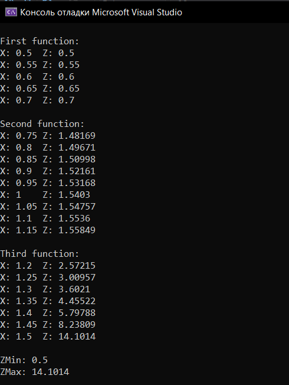
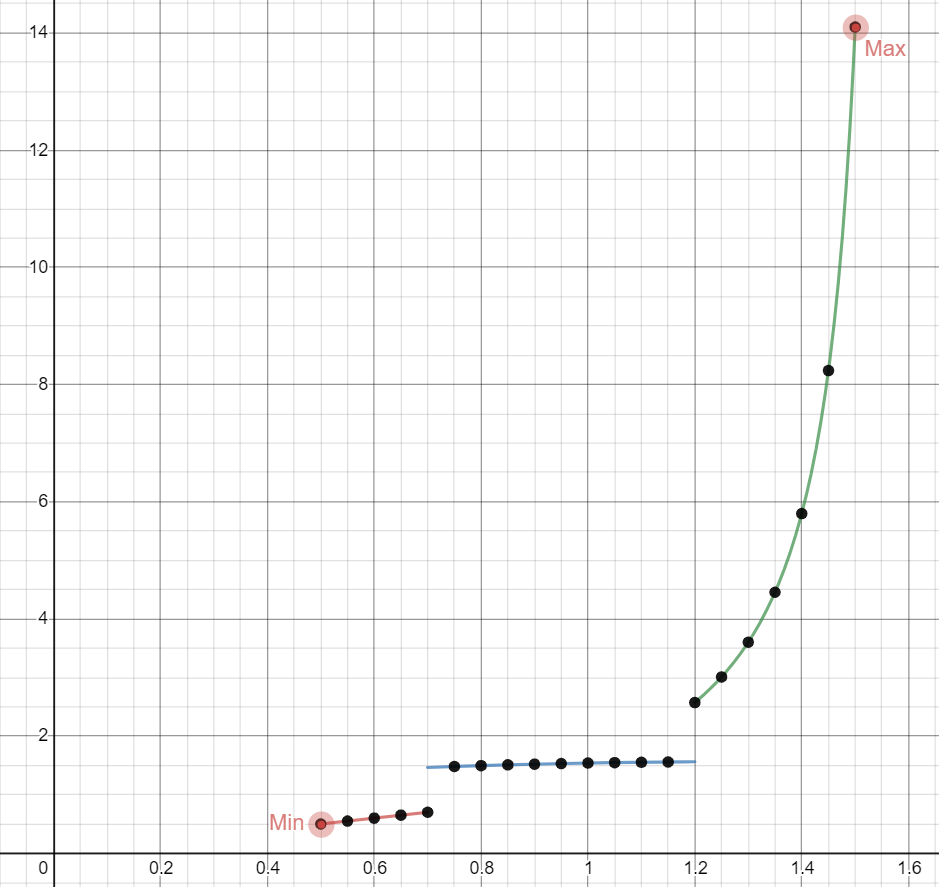

МИНИСТЕРСТВО НАУКИ  И ВЫСШЕГО ОБРАЗОВАНИЯ РОССИЙСКОЙ ФЕДЕРАЦИИ  
Федеральное государственное автономное образовательное учреждение высшего образования  
"КРЫМСКИЙ ФЕДЕРАЛЬНЫЙ УНИВЕРСИТЕТ им. В. И. ВЕРНАДСКОГО"  
ФИЗИКО-ТЕХНИЧЕСКИЙ ИНСТИТУТ  
Кафедра компьютерной инженерии и моделирования
<br/><br/>
​
### Отчёт по лабораторной работе № 2<br/> по дисциплине "Программирование"
<br/>
​
студента 1 курса группы ИВТ-б-о-192(2)<br/>
Бородаев Виталий Олегович<br/><br/>
направления подготовки 09.03.01 "Информатика и Вычислительная Техника"
<br/>
​
<table>
<tr><td>Научный руководитель<br/> старший преподаватель кафедры<br/> компьютерной инженерии и моделирования</td>
<td>(оценка)<br/></td>
<td>Чабанов В.В.</td>
</tr>
</table>
<br/><br/>

Симферополь, 2020
<br/><br/>

-------

# Табулирование функции

## Цель:

- Овладеть практическими навыками разработки и программирования вычислительного процесса циклической структуры;
- Сформировать навыков программирования алгоритмов разветвляющейся структуры;
- Изучить операторы ветвления. Особенности использования полной и сокращенной формы оператора if и тернарного оператора.

## Постановка задачи:

Напишите на языке С++ программу которая для функции f(x) на интервале x ∈ [хнач; xкон]:
- выводит в консоль значения функции f(x) с шагом dx;
- определяет максимальное и минимальное значение функции.

## Функции для табуляции

На данном рисунке приведён выполняемый вариант задачи (4): 


## Вывод в консоль



## График функции

График также доступен [по этой ссылке](https://www.desmos.com/calculator/zqoh02zjbq)



## Исходный код программы

Исходный код также доступен по [этой ссылке](code/main.cpp)

```cpp
#include <iostream>
#include <climits>
#include <cmath>

using namespace std;

const double E = std::exp(1.0);


const double A = 0.7;
const double B = 1.2;

double XNow;
const double XBeg = 0.5;
const double XEnd = 1.5;
const double dX = 0.05;

double ZMin = DBL_MAX;
double ZMax = DBL_MIN;

int comp_acc = 3;

bool is_double_equal(double first, double second) {
	double diff;
	long int comp;
	diff = first - second;
	for (int i = 0; i != comp_acc; i++) {
		diff = diff * 10;
	}
	comp = diff;
	if (comp == 0)
		return true;
	else
		return false;
}

int main()
{
	double Z;
	
	XNow = XBeg;

	cout << endl << "First function:" << endl;

	while ((XNow < A or is_double_equal(XNow, A)) and (XNow < XEnd or is_double_equal(XNow, XEnd))){
		Z = abs(XNow);
		if (Z < ZMin) ZMin = Z;
		if (Z > ZMax) ZMax = Z;
		cout << "X: " << XNow << "\t" << "Z: " << Z << endl;
		XNow += dX;
	}

	cout << endl << "Second function: " << endl;

	while ((XNow < B) and (XNow < XEnd or is_double_equal(XNow, XEnd))){
		Z = abs(XNow) + cos(XNow);
		if (Z < ZMin) ZMin = Z;
		if (Z > ZMax) ZMax = Z;
		cout << "X: " << XNow << "\t" << "Z: " << Z << endl;
		XNow += dX;
	}

	cout << endl << "Third function:" << endl;

	while ( (XNow > B or is_double_equal(XNow, B)) and ( XNow < XEnd or is_double_equal(XNow, XEnd) )){
		Z = tan(XNow);
		if (Z < ZMin) ZMin = Z;
		if (Z > ZMax) ZMax = Z;
		cout << "X: " << XNow << "\t" << "Z: " << Z << endl;
		XNow += dX;
	}

	cout << endl << "ZMin: " << ZMin;
	cout << endl << "ZMax: " << ZMax;
	
}
```

## Вывод

В ходе проделанной работы были получены следующие навыки:
- Создание математических функций в C++
- Табулирование функций при помощи программирования
- Создание графиков при помощи онлайн сервисов

Также были получены знания о:
- Библиотеках для работы с математическими фукнциями
- Закреплены знания о работе с Git