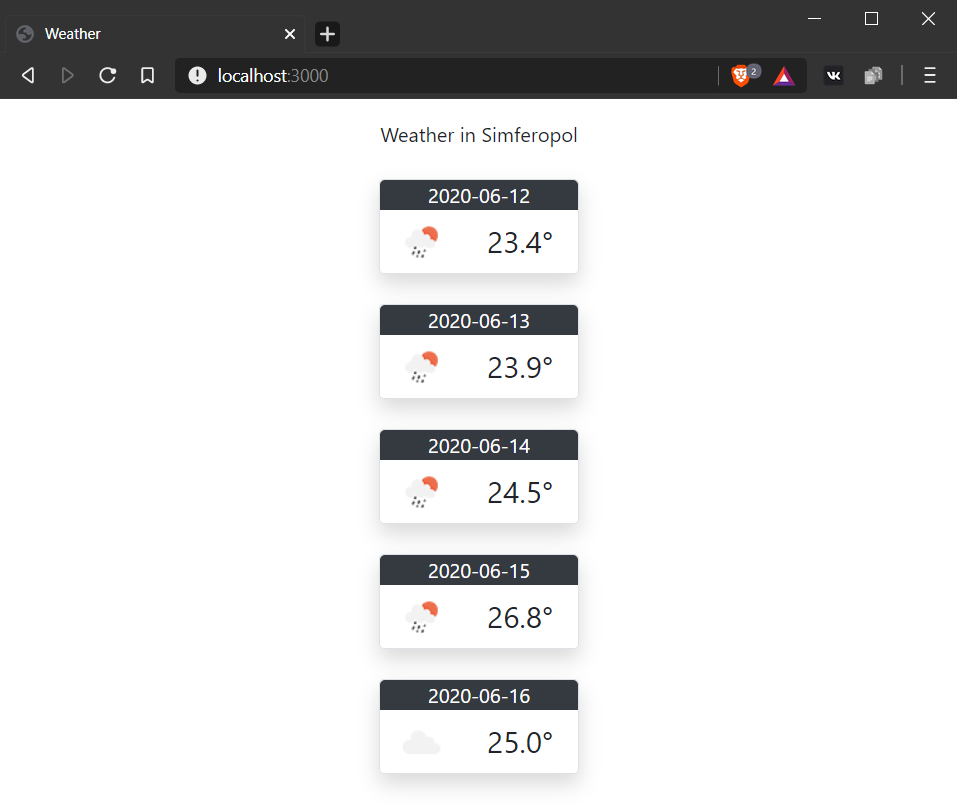

МИНИСТЕРСТВО НАУКИ  И ВЫСШЕГО ОБРАЗОВАНИЯ РОССИЙСКОЙ ФЕДЕРАЦИИ  
Федеральное государственное автономное образовательное учреждение высшего образования  
"КРЫМСКИЙ ФЕДЕРАЛЬНЫЙ УНИВЕРСИТЕТ им. В. И. ВЕРНАДСКОГО"  
ФИЗИКО-ТЕХНИЧЕСКИЙ ИНСТИТУТ  
Кафедра компьютерной инженерии и моделирования
<br/><br/>
​
### Отчёт по лабораторной работе № 5<br/> по дисциплине "Программирование"
<br/>
​
студента 1 курса группы ИВТ-б-о-192(2)<br/>
Бородаев Виталий Олегович<br/>
направления подготовки 09.03.01 "Информатика и Вычислительная Техника"
<br/>
​
<table>
<tr><td>Научный руководитель<br/> старший преподаватель кафедры<br/> компьютерной инженерии и моделирования</td>
<td>(оценка)<br/></td>
<td>Чабанов В.В.</td>
</tr>
</table>
<br/><br/>

Симферополь, 2020
<br/><br/>


------

# Погодный информер

## Цель:
- Закрепить навыки разработки многофайловыx приложений;
- Изучить способы работы с API web-сервиса;
- Изучить процесс сериализации/десериализации данных.

## Постановка задачи
Разработать приложение на языке С++ предназначенное для отображения прогноза погоды на ближайшие пять дней. В качестве источника данных о погоде использовать сервис https://openweathermap.org/.<br>
Вывод информации осуществлять при помощи web-интерфейса.


## Ход работы

### API Ключ

Ключ, используемый для работы с API openweathermap.org:

`39b9c46bc4299cb895d2ebdda8bdef5a`

### Код программы

```cpp
#include <iostream>
#include <fstream>
#include "libs/httplib/httplib.h"
#include "libs/json/json.hpp"

using namespace std;
using namespace nlohmann;
using namespace httplib;

string		template_content;

bool replace(string& subject, string search_value, string new_value) {
	if (subject.find(search_value) != std::string::npos) {
		subject = subject.replace(subject.find(search_value), search_value.length(), new_value);
		return true;
	}
	else
		return false;
}

bool get_forecast_in_json(json &forecast_dump){
	Client HTTPClient(R"(api.openweathermap.org)");
	auto response = *HTTPClient.Get(R"(/data/2.5/forecast?q=Simferopol&units=metric&appid=39b9c46bc4299cb895d2ebdda8bdef5a)");
	if (response.status != 200) return false;
	forecast_dump = json::parse(response.body);
	return true;
}

struct weather_day{
	string date;
	string temp;
	string icon;
};

string prepare_number(double number){
	return to_string(number).substr(0, to_string(number).find('.') + 2);
}

weather_day get_day(json dayobject){
	weather_day current_day;
	current_day.date = dayobject["dt_txt"].get<string>().substr(0, dayobject["dt_txt"].get<string>().find(" "));
	current_day.temp = prepare_number(dayobject["main"]["temp"].get<double>());
	current_day.icon = dayobject["weather"][0]["icon"].get<string>();
	return current_day;
}

void gen_response(const Request &request, Response& response){
	json forecast_dump;
	if (get_forecast_in_json(forecast_dump)){
		std::string template_copy = template_content;
		for (int i = 0; i < 40; i+=8){
			weather_day nextday = get_day(forecast_dump["list"][i]);
			replace(template_copy, "{list.dt}", nextday.date);
			replace(template_copy, "{list.main.temp}", nextday.temp);
			replace(template_copy, "{list.weather.icon}", nextday.icon);
		}
		replace(template_copy, "{city.name}", forecast_dump["city"]["name"]);
		response.set_content(template_copy, "text/html; charset=utf-8");
	}
	else {
		response.set_content("<h1>Internal server error</h1>", "text/html; charset=utf-8");
	}
}

int main() {
	Server HTTPServer;
	
	ifstream template_file;

	template_file.open(R"(../resources/template.html)");
	if (!template_file.is_open()) return EXIT_FAILURE;

	while (!template_file.eof()) {
		string newstr;
		template_file >> newstr;
		template_content += newstr + "\n";
	}
	template_file.close();

	HTTPServer.Get("/", gen_response);
	HTTPServer.listen("localhost", 3000);
}
```

### Скриншот демонстрации работы виджета

