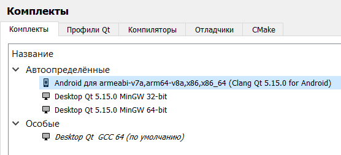
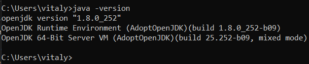
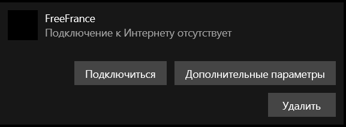
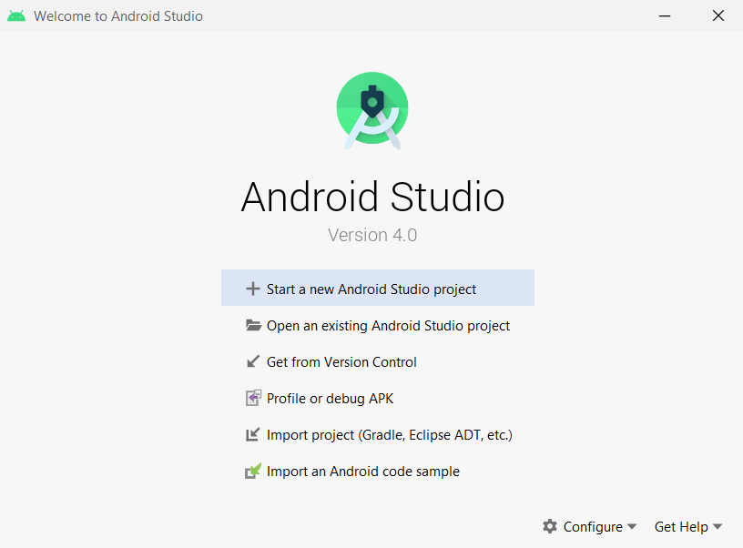
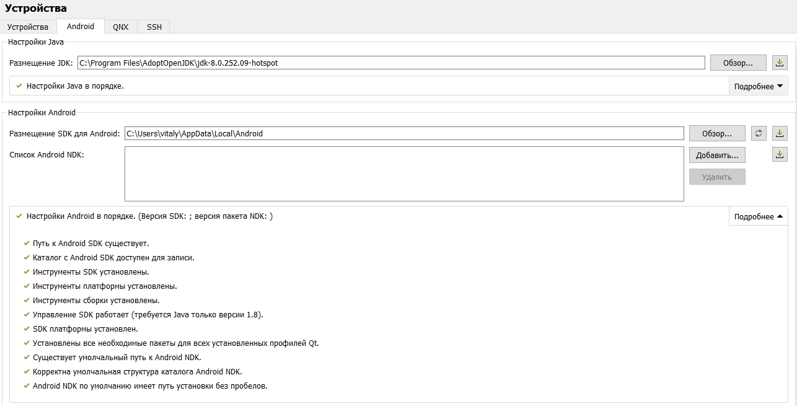

МИНИСТЕРСТВО НАУКИ  И ВЫСШЕГО ОБРАЗОВАНИЯ РОССИЙСКОЙ ФЕДЕРАЦИИ  
Федеральное государственное автономное образовательное учреждение высшего образования  
"КРЫМСКИЙ ФЕДЕРАЛЬНЫЙ УНИВЕРСИТЕТ им. В. И. ВЕРНАДСКОГО"  
ФИЗИКО-ТЕХНИЧЕСКИЙ ИНСТИТУТ  
Кафедра компьютерной инженерии и моделирования
  
​
### Отчёт по лабораторной работе №8   по дисциплине "Программирование"
 
​
студента 1 курса группы ИВТ-б-о-192(2) 
Бородаев Виталий Олегович 
направления подготовки 09.03.01 "Информатика и Вычислительная Техника"
 
​
<table>
<tr><td>Научный руководитель  старший преподаватель кафедры  компьютерной инженерии и моделирования</td>
<td>(оценка) </td>
<td>Чабанов В.В.</td>
</tr>
</table>
  

Симферополь, 2020

-------

# Настройка QT Creator для Android

## Цель

- Настроить IDE Qt Creator для разработки приложений под android OC
- Изучить базовые понятия, связанные с мобильной разработкой
- Научиться создавать мобильные приложения при помощи фреймворка Qt 5.14

## Инструменты

- IDE Qt Creator с набором предварительно собранных компонентов фреймворка Qt 5.14 для android
- Java SE Development Kit 8 (JDK) или Open JDK
- Android Studio
- Компоненты для сборки приложений

## Ход работы

### Установка компонента для Qt

При помощи инструмента `MaintenanceTool` был установлен пакет Android для среды разработки Qt Creator.
 

*Рис. 1. Установленный Qt пакет.* 

### Установка JDK

На сайте Adopt JDk была выбрана соответствующая архитектура и система, после чего скачан и установлен пакет msi. 
Для проверки правильности установки в консоль была введена команада "java -version". 

*Рис. 2. Проверка установки JDK.*

### Установка Android Studio

В связи с санкциями против Республики Крым
Для загрузки данной среды разработки был подключен VPN в Windows 10 из открытого источника `vpnbook.com`

*Рис. 3. Подключение VPN.*

После установки Android Studio были установлены пакеты SDK, NDK и Google USB Driver.

*Рис. 4. Стартовое окно Android Studio.*

### Настройка Qt Creator

После настройки Qt Creator окно среды разработки приняло вид, изображенный на рисунке 5.

*Рис. 5. Настройка Qt Creator*

### Подключение и сборка приложения под Android

Для примера сборки был выбран проект с Qt эффектом шейдеров. 
После сборки и запуска отладки на экране мобильного телефона появилось следующее приложение. 

*Рис. 6. Готовое приложение на экране телефона*

## Вывод

В ходе проделанной работы были получены следующие навыки:

- Установка SDK для разработки мобильных приложение под Android
- Настройка среды разработки Qt Creator
- Отладка при помощи USB на устройстве под ОС Android