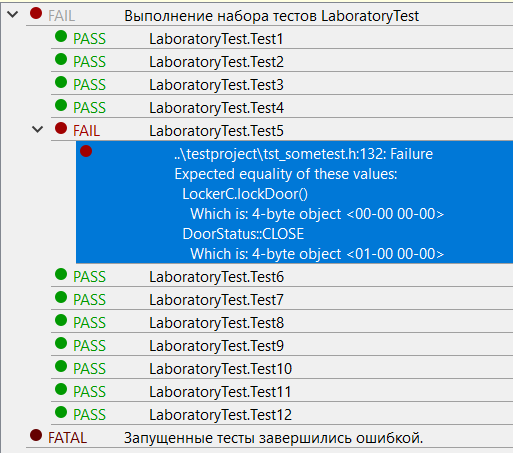

МИНИСТЕРСТВО НАУКИ  И ВЫСШЕГО ОБРАЗОВАНИЯ РОССИЙСКОЙ ФЕДЕРАЦИИ  
Федеральное государственное автономное образовательное учреждение высшего образования  
"КРЫМСКИЙ ФЕДЕРАЛЬНЫЙ УНИВЕРСИТЕТ им. В. И. ВЕРНАДСКОГО"  
ФИЗИКО-ТЕХНИЧЕСКИЙ ИНСТИТУТ  
Кафедра компьютерной инженерии и моделирования
<br/><br/>
​
### Отчёт по лабораторной работе №8 <br/> по дисциплине "Программирование"
<br/>
​
студента 1 курса группы ИВТ-б-о-192(2)<br/>
Бородаев Виталий Олегович<br/>
направления подготовки 09.03.01 "Информатика и Вычислительная Техника"
<br/>
​
<table>
<tr><td>Научный руководитель<br/> старший преподаватель кафедры<br/> компьютерной инженерии и моделирования</td>
<td>(оценка)<br/></td>
<td>Чабанов В.В.</td>
</tr>
</table>
<br/><br/>
<p align="center">Симферополь, 2020</p>
<hr>

-------

# Тестирование при помощи Google Test Framework

## Цель:

- Познакомиться с Google Test и Google Mock Framework;
- Изучить базовые понятия относящийся к тестированию кода;
- Научиться тестировать классы в среде разработки Qt Creator.

## Ход работы 

### Подготовка проекта и загрузка исходников
Для начала из оффициального репозитория был скачан Google Test Framework по [этой](https://github.com/google/googletest) ссылке.<br>
И тестовый проект, доступный по [этой](https://neroid.ru/wp-content/uploads/2020/05/Lab9_Project_for_tests.zip) ссылке.<br>
Оба архива были распакованы в одну директорию, в которой далее был создан проект тестирования Qt.<br>

### Выполнение тестирования проекта

#### Исходный код
Исходный код проекта с каждым тестом доступен по [этой](code/testproject/tst_sometest.h) ссылке, либо в данном репозитории по пути `code/testproject/tst_sometest.h`.<br>

#### Результаты тестирования

За исключением одного тестирования, все были проведены успешно, что изображено на рисунке 1.<br>



*Рис. 1. Результат тестирования проекта*

<br>

#### Поиск ошибки
Ошибка была выявлена на этапе проведения тестирования под номером `5`. <br>

Корни ошибки находятся в исходном коде файла `lockcontroller.cpp` на 45 строке.

Исходный код функции `LockController::lockDoor()`

```cpp
DoorStatus LockController::lockDoor()
{
    return latch->open();
}
```

Данная функция, судя по названию функции, должна выполнять закрытие замка.<br>
Однако, внутри тела выполняется метод, реализующий открытие замка, что всегда возвращает статус открытой двери.<br>
Таким образом, скорее всего, по случайности была допущена опечатка в процессе разработки.<br>
<br>
Верный вариант исходного когда для данной функции

```cpp
DoorStatus LockController::lockDoor()
{
    return latch->close();
}
```

## Вывод

В ходе проделанной лабораторной работы были получены знания о принципах и основных конструкциях фреймворка Google Test.
Также были отработаны следующие навыки:
- Создание автоматических тестов при помощи среды разработки Qt
- Создание тестов при помощи фреймворка Google Test
- Поиск ошибок в соответствии с результами тестирования
